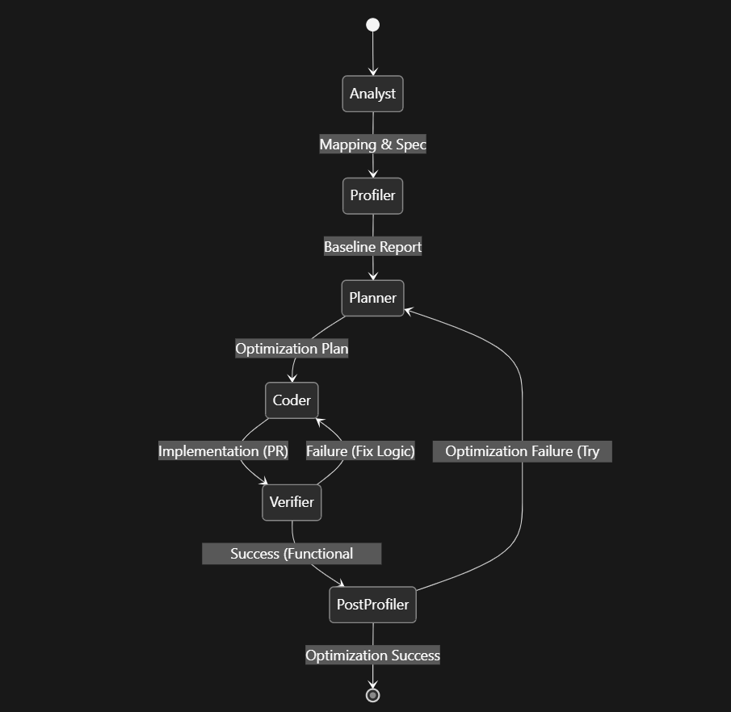

# LASSI-Agentic Flow

This repository implements an agentic workflow focused on code performance optimization, C/C++ to PyTorch translation, verification, profiling, and model artifact generation.

## Key Components

### LASSI MCP Server
- FastMCP server entrypoint: `LASSI_mcp.py`
- Server name: `LASSI`
- Provides tools for:
  - gprof-based profiling
  - executable latency and power/energy profiling
  - CPU, RAM, GPU, and toolchain inspection
  - numeric CSV summarization, comparison, and mismatch reports
  - PyTorch model export to `.pt`
  - PyTorch `.pt` lowering to MLIR through `torch-mlir`
- Provides resources for:
  - compiler flag cheat sheets at `compiler://{name}/flags`

<details>
  <summary>Available MCP Tools</summary>

  | Tool | Description | Parameters |
  |------|-------------|------------|
  | `gprof_profiling` | Compiles source file(s) with gprof instrumentation and returns callgraph information. | `path`, `compiler` (optional), `kwds` (optional), `includes` (optional), `libraries` (optional), `args` (optional) |
  | `execute_with_latency` | Runs an executable and returns stdout/stderr plus execution timing. | `path`, `args` (optional), `dump_output` (optional), `expected_output` (optional) |
  | `execute_with_profile` | Runs an executable and returns stdout/stderr plus multi-profiler timing, CPU power, and GPU power reporting when probes are available. | `path`, `args` (optional), `dump_output` (optional), `expected_output` (optional) |
  | `get_machine_info` | Returns CPU and RAM information from the MCP runtime environment. | None |
  | `get_gpu_info` | Returns GPU information using available `nvidia-smi`, `rocm-smi`, or `xpu-smi` tooling. | None |
  | `get_toolchain_info` | Returns Python, torch, torch-mlir, and LLVM-related toolchain information from the MCP runtime environment. | None |
  | `summarize_csv` | Summarizes a numeric CSV file, including shape, size, range, mean/std, and NaN/Inf checks. | `path` |
  | `compare_csv_outputs` | Compares golden and candidate numeric CSV outputs with exact and tolerant match status plus error metrics. | `golden_csv`, `candidate_csv`, `rtol` (optional), `atol` (optional), `expected_shape` (optional) |
  | `diff_csv_outputs` | Reports element-wise CSV mismatches and can write the mismatch report as JSON. | `golden_csv`, `candidate_csv`, `output_path` (optional), `max_rows` (optional) |
  | `export_model_to_pt` | Loads a PyTorch model class from a Python file and exports a `.pt` artifact. | `model_file`, `class_name`, `output_path`, `init_args` (optional), `weights_path` (optional), `export_type` (optional), `input_shape` (optional) |
  | `compile_torch_to_mlir` | Compiles a PyTorch `.pt` model into MLIR using `torch-mlir`. | `model_path`, `inputs`, `target` (optional), `frontend` (optional), `validate` (optional), `output_path` (optional) |
</details>

### Workflow Sessions (RooCode Optimized)

The `.roo/rules-*` folders define the behavior for the LASSI workflow sessions. Copy these rule folders into Roo's global `.roo` directory along with `custom_modes.yaml`.

#### General Optimization Workflow
Defined by `.roo/rules-lassi-orchestrator/rules.md`:

1. **Workspace Setup** - confirm the project directory, constraints, and `LASSI/` artifact folder.
2. **Analysis** - `LASSI Analyst` maps the project and writes `LASSI/phase1_analysis.md`.
3. **Baseline Profiling** - `LASSI Profiler` establishes latency, energy, and hotspot baselines in `LASSI/phase2_baseline.md`.
4. **Planning** - `LASSI Planner` writes `LASSI/refactor-plan.md` with measurable targets.
5. **Implementation** - `LASSI Coder` applies scoped changes and writes `LASSI/changes.md`.
6. **Verification** - `LASSI Verifier` checks functional equivalence and writes `LASSI/verification_report.md`.
7. **Final Profiling** - `LASSI Post Profiler` compares optimized metrics against baseline in `LASSI/comparison.md`.
8. **Finalization** - the orchestrator writes `LASSI/final_summary.md` with metrics, correctness status, and unresolved risks.

#### C/C++ to PyTorch Translation Workflow
Defined by `.roo/rules-translator-orchestrator/rules.md`:

1. **Environment Setup** - confirm the source entrypoint, build/run command, input shapes/dtypes, constraints, and toolchain details from `get_toolchain_info`.
2. **Analysis** - `LASSI Analyst` reads the source and project docs, then writes or updates `LASSI/phase1_analysis.md`.
3. **Translation Implementation** - `LASSI Translator` writes export-friendly PyTorch candidate variants and `LASSI/translation_notes.md`.
4. **Verification** - `LASSI Verifier` compares every candidate against the original C/C++ oracle, preferring CSV artifacts and the MCP CSV tools.
5. **Variant Selection** - `LASSI Profiler` benchmarks multiple verified variants when needed and records the selected export candidate.
6. **Model Generation** - `LASSI Model Generator` uses `get_toolchain_info`, `export_model_to_pt`, and `compile_torch_to_mlir` to produce `.pt` and MLIR artifacts, then writes `LASSI/model_generation.md`.
7. **Finalization** - the orchestrator writes `LASSI/translation_final_summary.md` with equivalence, variants, selected artifacts, fallback paths, and risks.

The rules require LASSI MCP tools for compile/export/lowering tasks whenever a matching MCP tool exists. File authoring and edits still happen in the workspace files.

<details>
  <summary>Workflow Diagram</summary>

  
</details>

## Installation

Run these commands from the repository root:

```bash
cd ~/LASSI-TOOLS
```

1. **Install Roo Code**

   Follow the Roo Code install guide: https://docs.roocode.com/getting-started/installing

2. **Install the LASSI Roo modes and rules**

   Roo loads global custom modes from `settings/custom_modes.yaml`. For a VS Code Remote server, that settings directory is:

   ```bash
   ROO_SETTINGS="$HOME/.vscode-server/data/User/globalStorage/rooveterinaryinc.roo-cline/settings"
   ```

   Install the LASSI mode definitions and their matching global rule folders:

   ```bash
   mkdir -p "$ROO_SETTINGS" "$HOME/.roo"
   cp custom_modes.yaml "$ROO_SETTINGS/custom_modes.yaml"
   cp -R .roo/rules-* "$HOME/.roo/"
   ```

   This overwrites Roo's global `custom_modes.yaml`. If you already have other custom modes, merge this file into the existing one instead of copying it over. Copy the bundled `.roo/rules-*` folders as-is so each workflow session can load its matching rules.

3. **Configure the LASSI MCP server**

   Use Docker when you want the MCP server and its Python dependencies to run in a container:

   ```bash
   ./setup_mcp_docker.sh
   ```

   Use Conda when you want the MCP server to run directly on the host:

   ```bash
   conda create --name LASSI python=3.12
   conda activate LASSI
   pip install -r requirements.txt
   python configure_MCP.py --mode conda --conda-env LASSI
   ```

   Docker mode writes a Roo MCP entry that launches `LASSI_mcp.py` through `docker run`. Conda mode writes a Roo MCP entry that launches `LASSI_mcp.py` through `conda run`.

4. **Reload Roo Code**

   Reload the VS Code window or restart the Roo Code extension. The mode dropdown should include:

   - `LASSI Optimizer`
   - `LASSI Torch Translator`
   - `LASSI Analyst`
   - `LASSI Profiler`
   - `LASSI Planner`
   - `LASSI Coder`
   - `LASSI Translator`
   - `LASSI Verifier`
   - `LASSI Model Generator`
   - `LASSI Post Profiler`
